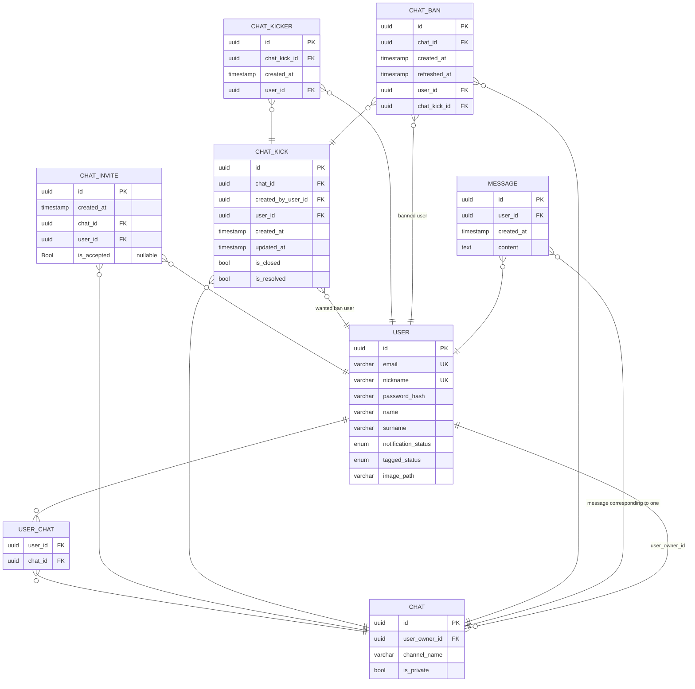
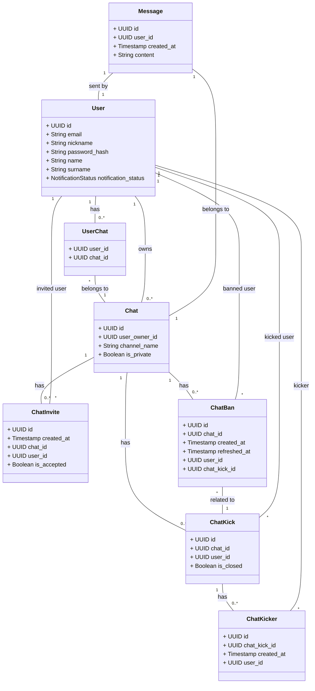
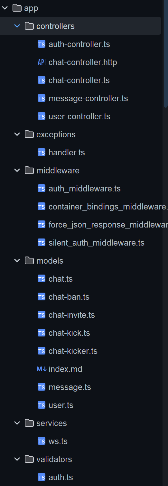
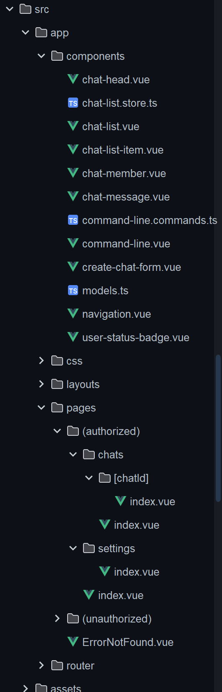
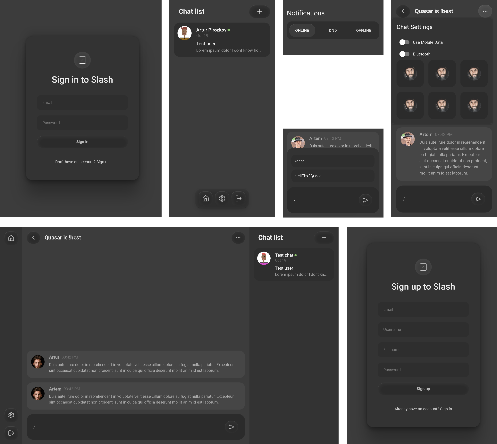

# slash

```shell
npm run dev
```

### Requirements

> Vytvorte progresívnu webovú aplikáciu na textovú komunikáciu v štýle IRC (Slack), ktorá komplexne rieši nižšie
> definované prípady použitia.
>
> 1. registrácia, prihlásenie a odhlásenie používateľa
> - používateľ má meno a priezvisko, nickName a email
> 2. používateľ vidí zoznam kanálov, v ktorých je členom
> - pri opustení kanála, alebo trvalom vyhodení z kanála je daný kanál odobratý zo zoznamu
> - pri pozvánke do kanála je daný kanál zvýraznený a topovaný
> - v zozname môže cez používateľské rozhranie kanál vytvoriť, opustiť, a ak je správcom aj zrušiť
> - dva typy kanálov – súkromný (private channel) a verejný kanál (public channel)
> - správcom kanála je používateľ, ktorý kanál vytvoril
> - ak nie je kanál aktívny (nie je pridaná nová správa) viac, ako 30 dní, kanál prestáva existovať (následne je možné
    použiť channelName kanála pre „nový“ kanál)
> 3. používateľ odosiela správy a príkazy cez „príkazový riadok“, ktorý je „fixným“ prvkom aplikácie. používateľ môže
     > odoslať správu v kanáli, ktorého je členom
> 4. vytvorenie komunikačného kanála (channel) cez príkazový riadok
>
> - kanál môže vytvoriť ľubovolný používateľ cez príkaz /join channelName [private]
> - do súkromného kanála môže pridávať/odoberať používateľov iba správca kanála cez príkazy /invite nickName a /revoke
    > nickName
> - do verejného kanála sa môže pridať ľubovolný používateľ cez príkaz /join channelName (ak kanál neexistuje,
    automaticky
    > sa vytvorí)
> - do verejného kanála môže člen kanála pozvať iného používateľa príkazom /invite nickName
> - vo verejnom kanáli môže člen „vyhodiť“ iného člena príkazom /kick nickName. ak tak spravia aspoň 3 členovia,
    > používateľ má „trvalý“ ban pre daný kanál. správca môže používateľa vyhodiť „natrvalo“ kedykoľvek príkazom /kick
    > nickName, alebo naopak „obnoviť“ používateľovi prístup do kanála cez príkaz /invite
> - nickName, ako aj channelName sú unikátne
> - správca môže kanál zatvoriť/zrušiť príkazom /quit
> 5. používateľ môže zrušiť svoje členstvo v kanáli príkazom /cancel, ak tak spraví správca kanála, kanál zaniká
> 6. správu v kanáli je možné adresovať konkrétnemu používateľovi cez príkaz @nickname
> - správa je zvýraznená danému používateľovi v zozname správ
> 7. používateľ si môže pozrieť kompletnú históriu správ
> - efektívny inifinite scroll
> 8. používateľ je informovaný o každej novej správe prostredníctvom notifikácie
> - notifikácia sa vystavuje iba ak aplikácia nie je v stave "visible" (pozrite quasar docu App Visibility)
> - notifikácia obsahuje časť zo správy a odosielateľa
> - používateľ si môže nastaviť, aby mu chodili notifikácie iba pre správy, ktoré sú mu adresované
> 9. používateľ si môže nastaviť stav (online, DND, offline)
> - stav sa zobrazuje používateľom
> - ak je nastavený DND stav, neprichádzajú notifikácie
> - ak je nastavený offline stav, neprichádzajú používateľovi správy, po prepnutí do online sú kanály automaticky
    > aktualizované
> 10. používateľ si môže pozrieť zoznam členov kanála (ak je tiež členom kanála) príkazom /list
> 11. ak má používateľ aktívny niektorý z kanálov (nachádza sa v okne správ pre daný kanál) vidí v stavovej lište
      > informáciu o tom, kto aktuálne píše správu (napr. Ed is typing)
> - po kliknutí na nickName si môže pozrieť rozpísaný text v reálnom čase, predtým, ako ju odosielateľ odošle (každá
    zmena je viditeľná) :-)

## Database structure

#### Latest migrations

- [create_user_notify_when_tagged_table.ts](modules/backend/database/migrations/1733666411455_create_user_notify_when_taggeds_table.ts)
  - Added new status column to control if notification are only when tagged (@nickname)
- [create_add_image_to_users_table.ts](modules/backend/database/migrations/1731479986221_create_add_image_to_users_table.ts)
  - Added `image_path` column to store user profile image
- [create_is_resolved_table.ts](modules/backend/database/migrations/1731474916532_create_is_resolveds_table.ts)
  - Added `is_resolved` column to `chat_kicks` table if the user is unbanned
- [create_chat_invites_updated_ats_table.ts](modules/backend/database/migrations/1731448460226_create_chat_invites_updated_ats_table.ts)
  - Added `updated_at` column to `chat_invites` table to control when the invite was accepted
- [create_update_to_have_created_by_users_table.ts](modules/backend/database/migrations/1731446387280_create_update_to_have_created_by_users_table.ts)
  - Added `created_by_user_id` column to `chat_kicks` table to control who kicked the user

### Entity-Relationship Diagram



### UML Class Diagram



## Project Architecture

### Pages to Controller & File Structure

<div style="display: grid; grid-template-columns: 1fr 1fr 1fr;">

<div style="grid-column: span 2;"> 

Next chart shows the relationship between the frontend and backend structure. The frontend is a Vue.js SPA and the
backend is a REST API. Shows which page requires which endpoint to be fetched.

```mermaid
flowchart LR

%% FRONTEND STRUCTURE
  subgraph Frontend [Frontend_VueJS_SPA]
    direction TB

    subgraph AuthorizedLayout [Authorized_Layout]
      Home["/ (Home)\nComponents:\n - home: authorized/index.vue\n - _: chat-list.vue"]
      Chats["/chats (Chats)\nComponents:\n - home: authorized/chats/index.vue"]
      Chat["/chats/:chatId (Chat)\nComponents:\n - home: authorized/chats/[chatId]/index.vue\n - chat-side: chat-list.vue"]
      Settings["/settings (Settings)\nComponents:\n - home: authorized/settings/index.vue"]
    end

    subgraph UnauthorizedLayout [Unauthorized_Layout]
      Login["/login (Login)\nComponent:\n - unauthorized/login/index.vue"]
      Register["/register (Register)\nComponent:\n - unauthorized/register/index.vue"]
    end

    NotFound["/:catchAll(.*)* (NotFound)\nComponent:\n - ErrorNotFound.vue"]
  end

%% BACKEND STRUCTURE
  subgraph Backend [Backend_REST_API]
    direction TB
  %% AUTH CONTROLLER
    subgraph AuthController [auth-controller]
      register["POST /user/register\nHandler: register"]
      login["POST /user/login\nHandler: login"]
      logout["POST /user/logout\nHandler: logout"]
    end

  %% CHAT CONTROLLER
    subgraph ChatController [chat-controller]
      byId["GET /chat/byId/:chat_id\nHandler: byId\nMiddleware: auth"]
      publicChats["GET /chat/public\nHandler: publicChats\nMiddleware: auth"]
      mineChats["GET /chat/mine\nHandler: mineChats\nMiddleware: auth"]
      joinChat["POST /chat/join/:chat_id\nHandler: joinChat\nMiddleware: auth"]
      createChat["PUT /chat/create\nHandler: createChat\nMiddleware: auth"]
      inviteToChat["POST /chat/invite\nHandler: inviteToChat\nMiddleware: auth"]
      invitedChats["GET /chat/invites\nHandler: invitedChats\nMiddleware: auth"]
      acceptChatInvite["POST /chat/invite/accept/:chat_id\nHandler: acceptChatInvite\nMiddleware: auth"]
      rejectChatInvite["DELETE /chat/invite/reject/:chat_id\nHandler: rejectChatInvite\nMiddleware: auth"]
      deleteOrQuit["DELETE /chat/:chat_id\nHandler: deleteOrQuit\nMiddleware: auth"]
      getUsersByChat["GET /chat/:chat_id/users\nHandler: getUsersByChat\nMiddleware: auth"]
      leaveChat["POST /chat/leave/:chat_id\nHandler: leaveChat\nMiddleware: auth"]
      destroyChat["DELETE /chat/destroy/:chat_id\nHandler: destroyChat\nMiddleware: auth"]
      kickUser["POST /chat/kick\nHandler: kickUser\nMiddleware: auth"]
      resolveKick["POST /chat/kick/resolve\nHandler: resolveKick\nMiddleware: auth"]
    end

  %% MESSAGE CONTROLLER
    subgraph MessageController [message-controller]
      getMessagesByChat["GET /message/byChat/:chat_id\nHandler: byChat\nMiddleware: auth"]
      sendMessage["POST /message/send\nHandler: sendMessage\nMiddleware: auth"]
    end

  %% USER CONTROLLER
    subgraph UserController [user-controller]
      getMe["GET /user/me\nHandler: getMe\nMiddleware: auth"]
      queryUsers["GET /user/byQuery/:query\nHandler: queryUsers\nMiddleware: auth"]
      getUsersByChatId["GET /user/byChat/:chat_id\nHandler: getUsersByChatId\nMiddleware: auth"]
      setStatus["POST /user/notifications\nHandler: setStatus\nMiddleware: auth"]
      setNotifyWhenTagged["POST /user/notificationsWhenTagged\nHandler: setNotifyOnlyWhenTaggedStatus\nMiddleware: auth"]
    end

    deleteOldChats["GET /delete-old-chats\nHandler: closure"]
  end

%% RELATIONSHIPS BETWEEN FRONTEND AND BACKEND
  Home -->|Requires Auth| getMe
  Chats -->|Fetch user chats| mineChats
  Chat -->|Fetch chat messages| getMessagesByChat
  Chat -->|Fetch chat info| byId
  Settings -->|Fetch user settings| getMe
  Settings -->|Update notification status| setStatus
  Login -->|POST Login| login
  Register -->|POST Register| register
  Frontend -->|HTTP Requests| Backend
```



</div>

<div>

#### Backend



#### Frontend



</div>

</div>

## Project Structure

### Libraries

On the frontend side, we in additional to standard Vue.js + Quasar structure with libraries we use:

```json lines
"@quasar/extras": "^1.16.4",
"axios": "^1.7.7", // Used for auth interceptors and easy-to-use HTTP requests
"core-js": "^3.31.1",
"quasar": "^2.16.0",
"vue": "^3.4.18",
"vue-router": "^4.0.12", // Used for routing in SPA. We also used a Next.js like pages structure.
"@slash/backend": "*" // We import the backend package, as we use npm monorepo, what allows us to use the backend types and interfaces in the frontend for type safe development.
"socket.io": "^4.8.1" // Used for real-time communication (sending messages, notifications, etc.)
```

On the backend side, we use:

```json lines
"@adonisjs/auth": "^9.2.4",
"@adonisjs/core": "^6.14.1",
"@adonisjs/cors": "^2.2.1",
"@adonisjs/lucid": "^21.3.0",
"@adonisjs/session": "^7.5.0",
"@vinejs/vine": "^2.1.0", // In register and login controllers, we use vine for validation user input
"luxon": "^3.5.0",
"node-cron": "^3.0.3", // For checking and deleting inactive chats
"pg": "^8.13.0",
"reflect-metadata": "^0.2.2",
"socket.io": "^4.8.1" // Used for real-time communication (sending messages, notifications, etc.)
```

## User Interface



