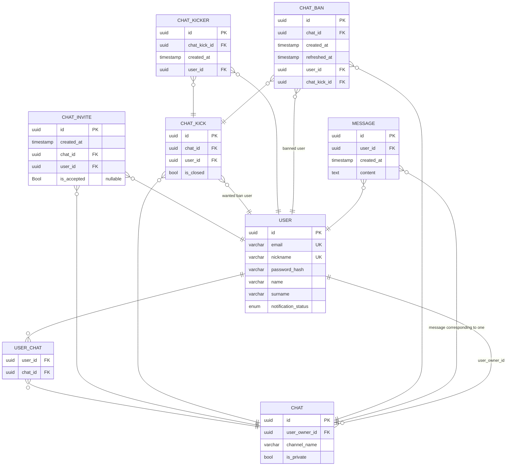
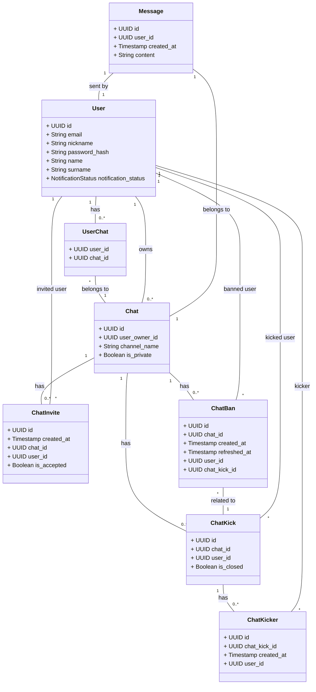

# Diagrams

## Entity-Relationship Diagram

```mermaid
erDiagram
  USER {
    uuid id PK
    varchar email UK
    varchar nickname UK
    varchar password_hash
    varchar name
    varchar surname
    enum notification_status
  }

  USER_CHAT {
    uuid user_id FK
    uuid chat_id FK
  }
  USER || -- o{ USER_CHAT: ""
  USER_CHAT }o -- || CHAT: ""

  CHAT {
    uuid id PK
    uuid user_owner_id FK
    varchar channel_name
    bool is_private
  }
  CHAT }o -- || USER: "user_owner_id"

  CHAT_INVITE {
    uuid id PK
    timestamp created_at
    uuid chat_id FK
    uuid user_id FK
    Bool is_accepted "nullable"
  }
  CHAT_INVITE }o -- || CHAT: ""
  CHAT_INVITE }o -- || USER: ""

  CHAT_KICK {
    uuid id PK
    uuid chat_id FK
    uuid user_id FK
    bool is_closed
  }
  CHAT_KICK }o -- || CHAT: ""
  CHAT_KICK }o -- || USER: "wanted ban user"

  CHAT_KICKER {
    uuid id PK
    uuid chat_kick_id FK
    timestamp created_at
    uuid user_id FK
  }
  CHAT_KICKER }o -- || CHAT_KICK: ""
  CHAT_KICKER }o -- || USER: ""

  CHAT_BAN {
    uuid id PK
    uuid chat_id FK
    timestamp created_at
    timestamp refreshed_at
    uuid user_id FK
    uuid chat_kick_id FK
  }
  CHAT_BAN }o -- || CHAT: ""
  CHAT_BAN }o -- || USER: "banned user"
  CHAT_BAN }o -- || CHAT_KICK: ""

  MESSAGE {
    uuid id PK
    uuid user_id FK
    timestamp created_at
    text content
  }
  MESSAGE }o -- || USER: ""
  MESSAGE }o--|| CHAT: "message corresponding to one"
```

## UML Class Diagram

```mermaid
classDiagram
%% Classes
  class User {
    + UUID id
    + String email
    + String nickname
    + String password_hash
    + String name
    + String surname
    + NotificationStatus notification_status
  }

  class UserChat {
    + UUID user_id
    + UUID chat_id
  }

  class Chat {
    + UUID id
    + UUID user_owner_id
    + String channel_name
    + Boolean is_private
  }

  class ChatInvite {
    + UUID id
    + Timestamp created_at
    + UUID chat_id
    + UUID user_id
    + Boolean is_accepted
  }

  class ChatKick {
    + UUID id
    + UUID chat_id
    + UUID user_id
    + Boolean is_closed
  }

  class ChatKicker {
    + UUID id
    + UUID chat_kick_id
    + Timestamp created_at
    + UUID user_id
  }

  class ChatBan {
    + UUID id
    + UUID chat_id
    + Timestamp created_at
    + Timestamp refreshed_at
    + UUID user_id
    + UUID chat_kick_id
  }

  class Message {
    + UUID id
    + UUID user_id
    + Timestamp created_at
    + String content
  }

%% Relationships
  User "1" -- "0..*" UserChat: has
  UserChat "*" -- "1" Chat: belongs to
  User "1" -- "0..*" Chat: owns
  Chat "1" -- "0..*" ChatInvite: has
  ChatInvite "*" -- "1" User: invited user
  Chat "1" -- "0..*" ChatKick: has
  ChatKick "*" -- "1" User: kicked user
  ChatKick "1" -- "0..*" ChatKicker: has
  ChatKicker "*" -- "1" User: kicker
  Chat "1" -- "0..*" ChatBan: has
  ChatBan "*" -- "1" User: banned user
  ChatBan "*" -- "1" ChatKick: related to
  Message "1" -- "1" User: sent by
  Message "1" -- "1" Chat: belongs to
```
